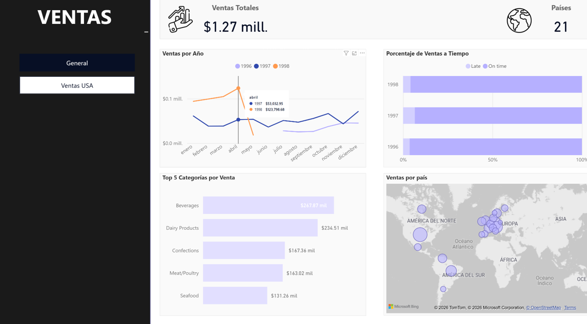
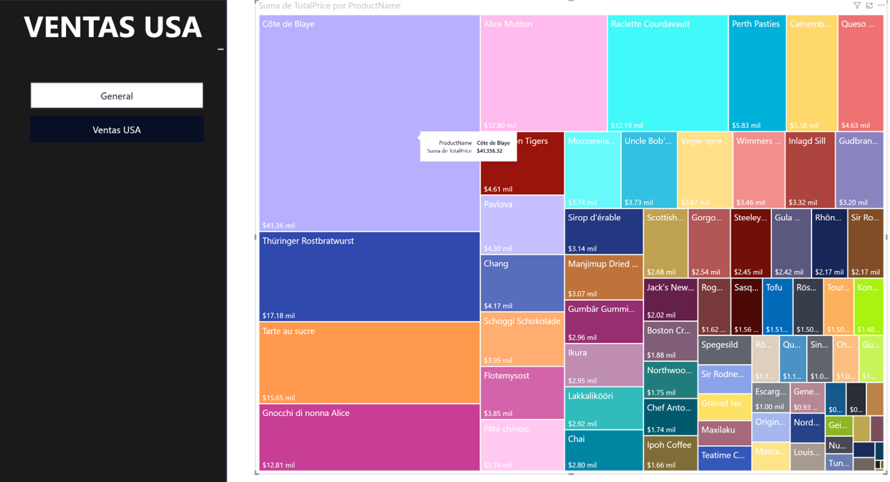

# Power BI — Northwind Sales Dashboard

Dashboard en Power BI con datos de **Northwind** (empresa ficticia) para monitorear ventas, desempeño por categoría y distribución geográfica.

**Repo:** https://github.com/mariafernandaglezmora-01/Northwind_PowerBI_Dashboard

---

## Vista rápida (capturas)

---

## Qué responde este dashboard
- ¿Cuál es el total de ventas y su tendencia en el tiempo?
- ¿Cuáles son las categorías con mayor contribución a ventas?
- ¿Qué porcentaje de órdenes se entregan a tiempo vs tarde?
- ¿Cómo se distribuyen las ventas por país?
- ¿Cuáles productos concentran mayor venta en USA?

---

## Páginas incluidas
- **General:** KPIs, evolución temporal, top categorías, cumplimiento de entregas y mapa por país.
- **Ventas USA:** vista detallada de ventas por producto (treemap) y exploración del desempeño.

---

## Archivo PBIX
Abrir con **Power BI Desktop (Windows)**:  
[northwind_sales_dashboard.pbix](powerbi/northwind_sales_dashboard.pbix)

---

## Datos
- Dataset **Northwind** (empresa ficticia) usado con fines educativos/portafolio.
- Este repositorio se enfoca en el diseño del dashboard y la comunicación de resultados (sin datos sensibles).

---

## Herramientas
Power BI Desktop, Power Query, modelado relacional y medidas/columnas (DAX).

